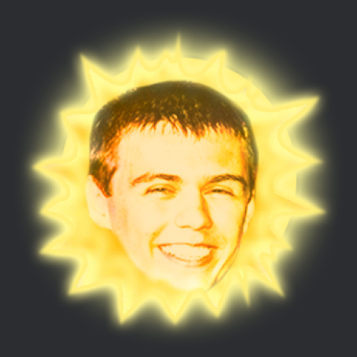
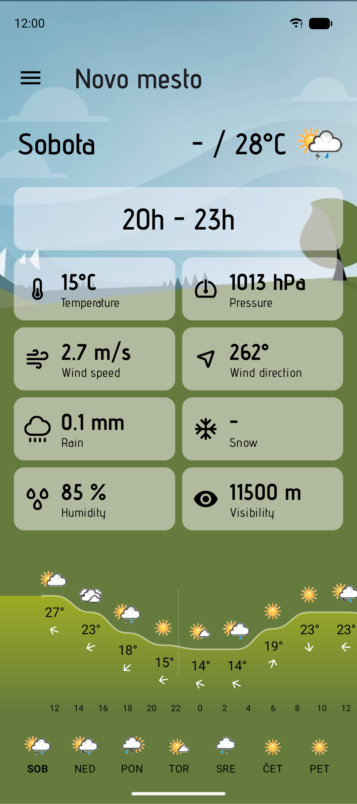
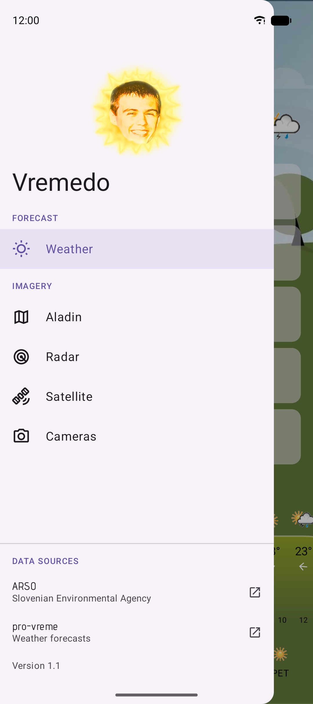
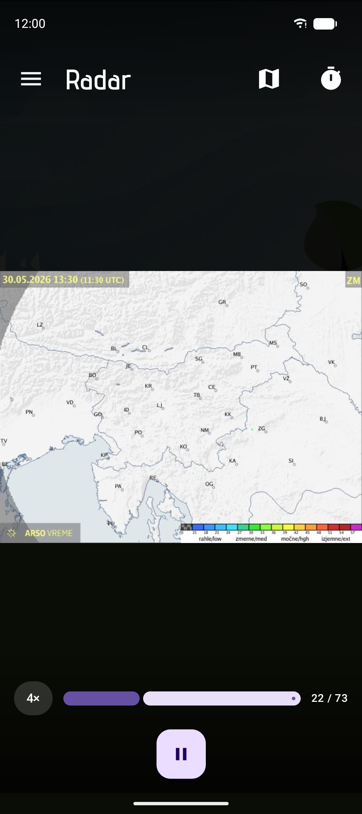
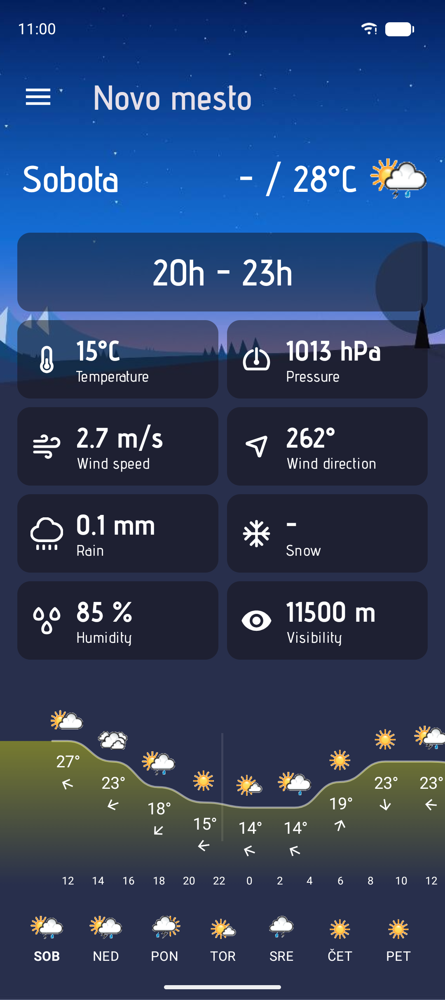
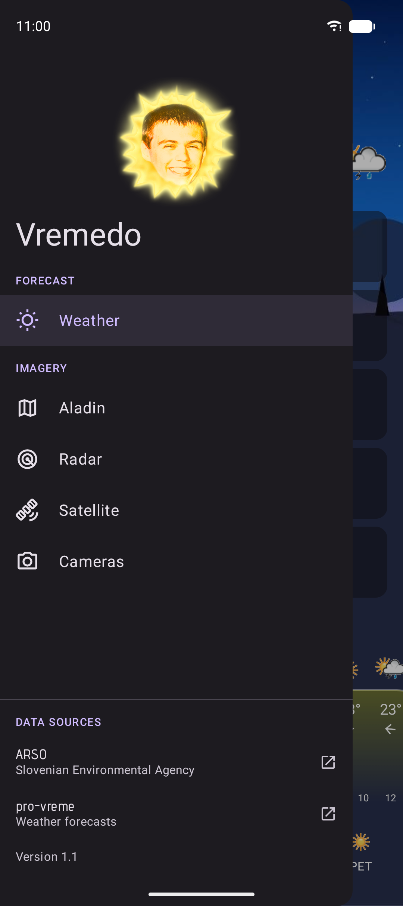
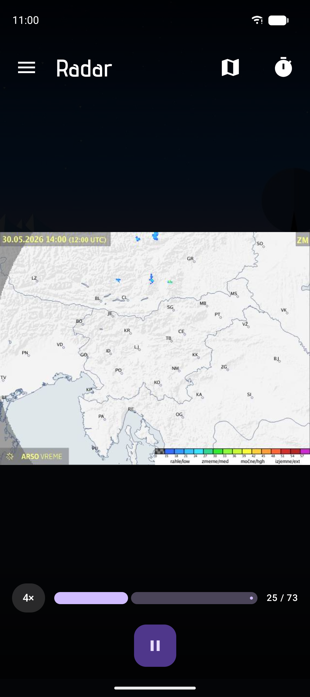

<div align="center">



# Vremedo

A small Slovenian weather app for Android, built around the data ARSO already
publishes - forecasts, radar, satellite, the ALADIN model and the public
webcams.

</div>

---

`Vreme` is Slovenian for *weather*. `Edo` is a friend whose face ended up as the
app icon. Put them together, and you get Vremedo, which is mostly a personal
project: I wanted the ARSO forecasts and imagery I check every day in one place,
without the official site's layout, and an excuse to build something
in Jetpack Compose.

It pulls everything from public sources at runtime - there's no backend of my
own. The weather numbers come from [pro-vreme.net](https://www.pro-vreme.net),
and all the maps, webcams and the sunrise/sunset times come straight from
[ARSO](https://meteo.arso.gov.si).

## Screenshots

|                           Forecast                           |                           Menu                            |                           Radar                            |
|:------------------------------------------------------------:|:---------------------------------------------------------:|:----------------------------------------------------------:|
|  |  |  |
|   |   |   |

## What it does

- **Forecast** - pick any Slovenian town and get its day-by-day and hour-by-hour
  forecast: temperature, pressure, wind speed and direction, rain, snow,
  humidity and visibility, plus a drawn temperature graph for the day.
- **ALADIN** - the animated ARSO model maps (rain & clouds, temperature, wind at
  ground / 700 m / 1500 m) for Slovenia and the wider Alps–Adriatic region.
- **Radar** - precipitation radar loops, short or long range, Slovenia or its
  neighbours.
- **Satellite** - visible (HRV) and infrared satellite imagery.
- **Webcams** - the ARSO network of public cameras, browsable by location and
  viewing direction, played back as a timelapse.

**The parsing is fragile.** ARSO and pro-vreme.net can change their markup
whenever they please, and when they do,
the matching screen breaks until I fix the parser.

### Stack

Kotlin 2.3 · Jetpack Compose (Material 3, Navigation, ConstraintLayout /
MotionLayout) · Koin for DI · Coil for image loading · OkHttp + Retrofit + Gson ·
Jsoup · kotlinx-datetime & coroutines · Timber · AGP 9. `minSdk` 26, `targetSdk` 37.

The project is split by data source rather than by layer:

- `:pro-vreme` - scraping and models for the pro-vreme.net forecasts.
- `:arso` - the same for the ARSO maps, webcams and sun times.
- `:scrape-utils` - the Jsoup glue both of those lean on.
- `:app` - the Compose UI sitting on top of all of it.

The point of the split is selfish: when one site rearranges its HTML, the mess
stays inside one module instead of leaking through the whole app.

## Building

You'll need Android Studio (or just the SDK) and a JDK. The Gradle wrapper
handles the rest.

```bash
# install the debug build on a connected device/emulator
./gradlew :app:installDebug
```

The debug app installs as **Vremedo🐛** with the `.debug` suffix, so it sits
happily next to a release install.

### Release builds

The release build is signed, so it needs a keystore. The signing config and the
version are read from environment variables, which keeps secrets out of the repo
and plays nicely with CI:

```bash
export KEYSTORE_FILE=/path/to/vremedo.jks
export KEYSTORE_PASSWORD=...
export KEY_ALIAS=...
export KEY_PASSWORD=...

./gradlew assembleRelease
```

## Disclaimer

Vremedo is an unofficial, non-commercial hobby project. It is not affiliated with
or endorsed by ARSO or pro-vreme.net - it just displays their public data. All
forecasts, imagery and warnings belong to their respective sources; for anything
you actually need to rely on, go to [pro-vreme.net](https://www.pro-vreme.net)
or [meteo.arso.gov.si](https://meteo.arso.gov.si).
