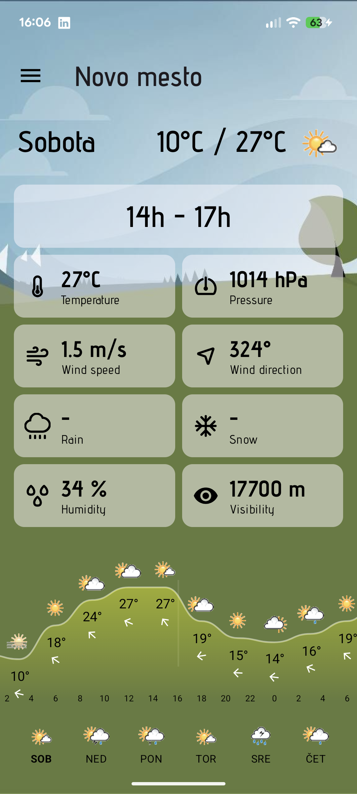
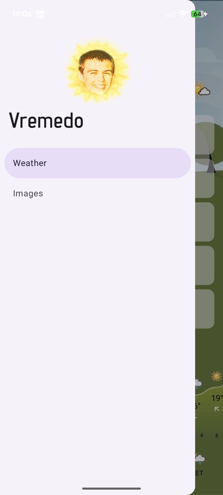
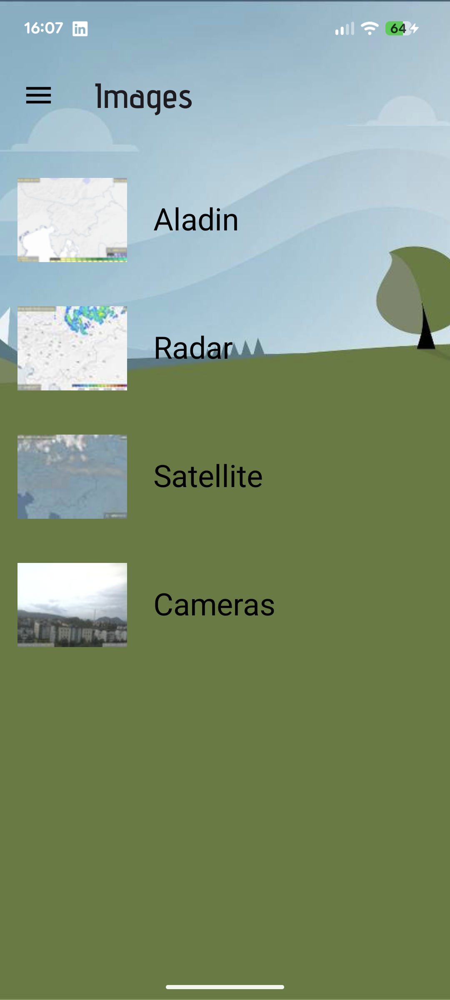
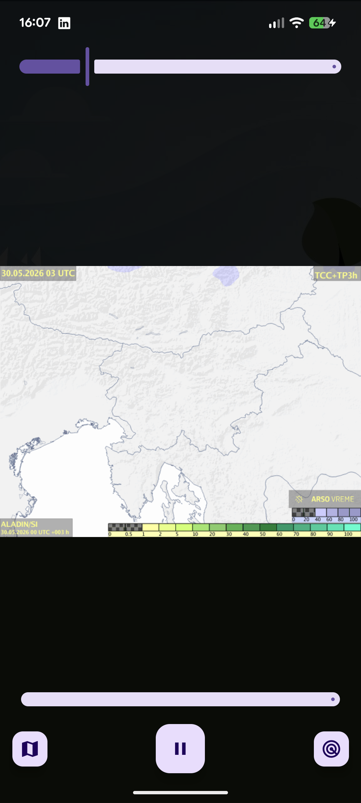
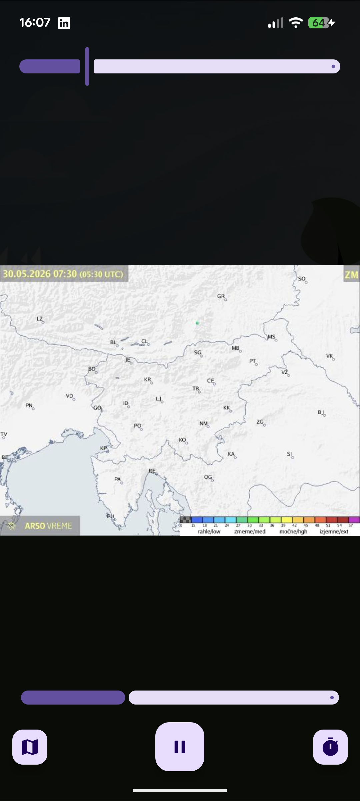
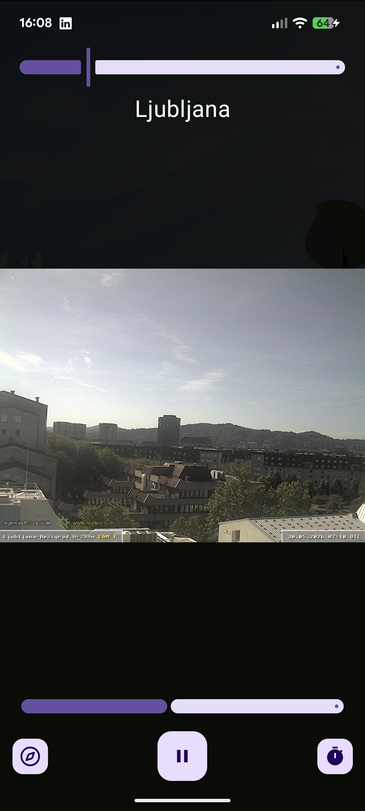

<div align="center">


# Vremedo

A small Slovenian weather app for Android, built around the data ARSO already
publishes - forecasts, radar, satellite, the ALADIN model and the public
webcams.

</div>

---

`Vreme` is Slovenian for *weather*. `Edo` is a friend whose face ended up as the
app icon. Put them together, and you get Vremedo, which is mostly a personal
project: I wanted the ARSO forecasts and imagery I check every day in one place,
without the official site's layout, and an excuse to build something
in Jetpack Compose.

It pulls everything from public sources at runtime — there's no backend of my
own. The weather numbers come from [pro-vreme.net](https://www.pro-vreme.net),
and all the maps, webcams and the sunrise/sunset times come straight from
[ARSO](https://meteo.arso.gov.si).

## Screenshots

|                        Forecast                        |                         Menu                         |                     Image gallery                      |
|:------------------------------------------------------:|:----------------------------------------------------:|:------------------------------------------------------:|
|  |   |   |
|                    **ALADIN model**                    |                      **Radar**                       |                      **Webcams**                       |
|   |  |  |

## What it does

- **Forecast** — pick any Slovenian town and get its day-by-day and hour-by-hour
  forecast: temperature, pressure, wind speed and direction, rain, snow,
  humidity and visibility, plus a drawn temperature graph for the day.
- **ALADIN** — the animated ARSO model maps (rain & clouds, temperature, wind at
  ground / 700 m / 1500 m) for Slovenia and the wider Alps–Adriatic region.
- **Radar** — precipitation radar loops, short or long range, Slovenia or
  neighbours.
- **Satellite** — visible (HRV) and infrared satellite imagery.
- **Webcams** — the ARSO network of public cameras, browsable by location and
  viewing direction, played back as a timelapse.

## How it's put together

It's a multi-module Gradle project. The two data modules are plain Kotlin/JVM
libraries with no Android dependencies, which keeps them unit-testable and
reusable:

| Module              | What lives here                                                                                                                                                                                                                                            |
|---------------------|------------------------------------------------------------------------------------------------------------------------------------------------------------------------------------------------------------------------------------------------------------|
| **`:app`**          | The whole UI: Jetpack Compose + Material 3, navigation, view models, the weather graph (drawn on a Canvas), the animated image players and the day/night theming.                                                                                          |
| **`:arso`**         | Client for ARSO. The structured forecast/location data comes from the `vreme.arso.gov.si` JSON API; radar, satellite, ALADIN, webcams, weather alerts (CAP) and the audio forecast are read from `meteo.arso.gov.si` and parsed out of its timeline files. |
| **`:pro-vreme`**    | Scraper for the per-town forecast tables on pro-vreme.net, using Jsoup.                                                                                                                                                                                    |
| **`:scrape-utils`** | Shared plumbing both scrapers lean on: OkHttp client setup, a user-agent and a force-HTTPS-redirect interceptor, and a handful of `String`/`Regex`/`Node` extensions.                                                                                      |

A fair warning that follows from all of this: **the parsing is inherently
fragile.** ARSO and pro-vreme.net can change their markup whenever they like, and
when they do, a screen will break until the parser is updated.

### Stack

Kotlin 2.3 · Jetpack Compose (Material 3, Navigation, ConstraintLayout /
MotionLayout) · Koin for DI · Coil for image loading · OkHttp + Retrofit + Gson ·
Jsoup · kotlinx-datetime & coroutines · Timber · AGP 9. `minSdk` 26, `targetSdk` 37.

## Building

You'll need Android Studio (or just the SDK) and a JDK. The Gradle wrapper
handles the rest.

```bash
# install the debug build on a connected device/emulator
./gradlew :app:installDebug
```

The debug app installs as **Vremedo🐛** with the `.debug` suffix, so it sits
happily next to a release install.

### Release builds

The release build is signed, so it needs a keystore. The signing config and the
version are read from environment variables, which keeps secrets out of the repo
and plays nicely with CI:

```bash
export KEYSTORE_FILE=/path/to/vremedo.jks
export KEYSTORE_PASSWORD=...
export KEY_ALIAS=...
export KEY_PASSWORD=...

./gradlew assembleRelease
```

## Disclaimer

Vremedo is an unofficial, non-commercial hobby project. It is not affiliated with
or endorsed by ARSO or pro-vreme.net — it just displays their public data. All
forecasts, imagery and warnings belong to their respective sources; for anything
you actually need to rely on, go to [pro-vreme.net](https://www.pro-vreme.net)
or [meteo.arso.gov.si](https://meteo.arso.gov.si).
</content>
</invoke>
